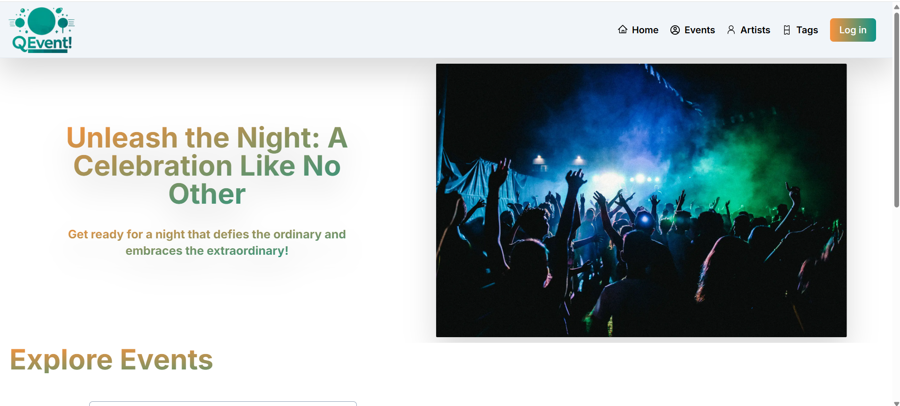
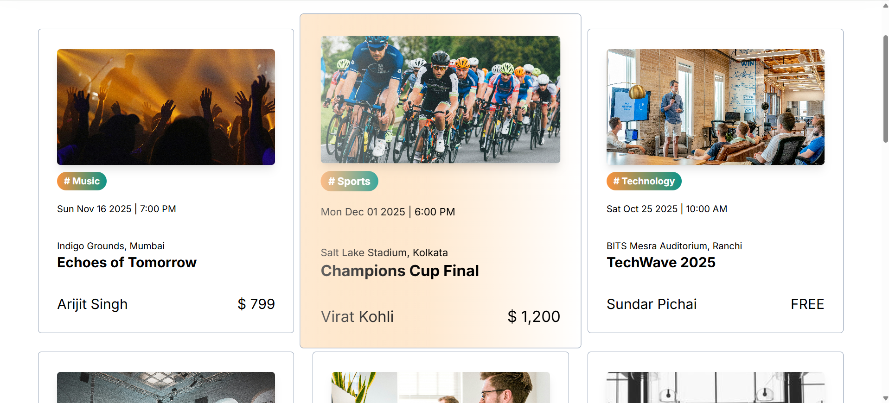
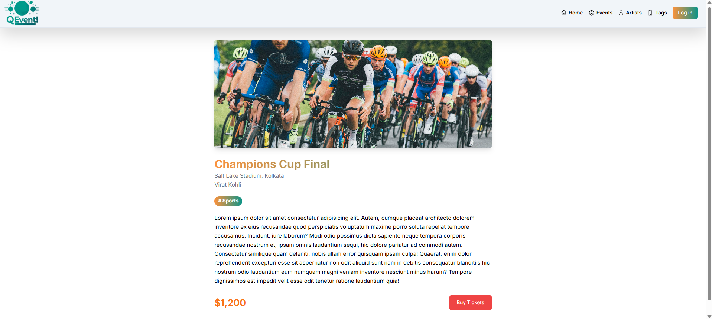

# QEvent

A modern event discovery and management platform built with Next.js. Browse events, explore artists, filter by tags, and manage your own events with Google authentication.

🔗 **Live Demo:** [qevent-kohl.vercel.app](https://qevent-kohl.vercel.app/)

## Screenshots

### Home Page


### Events Page


### Event Details


## Features

- **Event Discovery** — Browse and explore events with details like date, location, artist, and pricing
- **Artist Profiles** — View artist cards and filter events by a specific artist
- **Tag-Based Filtering** — Click on tags to filter events by category (Music, Sports, Technology, etc.)
- **Event Details Page** — Dedicated page for each event with full description and ticket info
- **Google Authentication** — Sign in with Google OAuth via NextAuth.js
- **Create Event** — Authenticated users can access the Create Event page
- **Responsive Design** — Fully responsive UI with Tailwind CSS

## Tech Stack

| Technology | Purpose |
|---|---|
| [Next.js 14](https://nextjs.org/) | React framework with App Router |
| [Tailwind CSS](https://tailwindcss.com/) | Utility-first CSS |
| [NextAuth.js](https://next-auth.js.org/) | Authentication (Google OAuth) |
| [Swiper](https://swiperjs.com/) | Image carousel on homepage |
| [Vercel](https://vercel.com/) | Deployment |

## Getting Started

### Prerequisites

- Node.js 18+
- npm
- Google OAuth credentials ([Google Cloud Console](https://console.cloud.google.com/))

### Installation

```bash
# Clone the repository
git clone https://github.com/PrabhavRathi06/qevent.git
cd qevent

# Install dependencies
npm install
```

### Environment Variables

Create a `.env.local` file in the root directory:

```env
NEXTAUTH_SECRET=<your-generated-secret>
NEXTAUTH_URL=http://localhost:3000
GOOGLE_ID=<your-google-client-id>
GOOGLE_SECRET=<your-google-client-secret>
```

Generate a secret with:

```bash
openssl rand -base64 32
```

### Run Development Server

```bash
npm run dev
```

Open [http://localhost:3000](http://localhost:3000) in your browser.

### Build for Production

```bash
npm run build
npm start
```

## Project Structure

```
qevent/
├── app/
│   ├── (home)/page.js          # Home page
│   ├── events/page.jsx         # Events listing with filtering
│   ├── events/[eventId]/page.jsx  # Event detail page
│   ├── artists/page.jsx        # Artists listing
│   ├── tags/page.jsx           # Tags listing
│   ├── create-event/page.jsx   # Create event (auth required)
│   ├── api/auth/[...nextauth]/ # NextAuth API route
│   ├── layout.js               # Root layout
│   └── globals.css             # Global styles
├── components/
│   ├── Header.jsx              # Navigation bar
│   ├── EventCard.jsx           # Event card component
│   ├── ArtistCard.jsx          # Artist card component
│   ├── Tag.jsx                 # Tag badge component
│   ├── SwiperComponent.jsx     # Homepage carousel
│   ├── SessionWrapper.jsx      # NextAuth session provider
│   └── theme-provider.jsx      # Theme provider
├── constants/                  # Static data
├── assets/images/              # Screenshots
└── public/images/              # Static assets
```

## API Endpoints

| Endpoint | Description |
|---|---|
| `https://qevent-backend.labs.crio.do/events` | Fetch all events |
| `https://qevent-backend.labs.crio.do/events/:id` | Fetch single event |
| `https://qevent-backend.labs.crio.do/artists` | Fetch all artists |

## Author

**Prabhav Rathi** — [@PrabhavRathi06](https://github.com/PrabhavRathi06)
